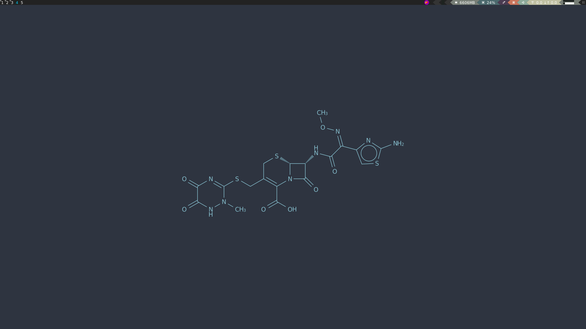

<div id="top"></div>

<!-- HEADER -->
<br />
<div align="center">
    

  <h2 align="center">My AwesomeWM Dotfiles on Debian</h2>

  <p align="center">
    List of everything I do on a Debian installation.
    <br />
    <br />
  </p>
</div>

<!-- ABOUT -->
## About



This repo is to serve as a backup to myself (or anyone interested) of my configurations.

### Built With

* [Debian](https://debian.org/)
* [Stow](https://www.gnu.org/software/stow/)
* [AwesomeWM](https://awesomewm.org/)
* [Awesome Copycats](https://github.com/lcpz/awesome-copycats)
* [Bash](https://www.gnu.org/software/bash/)
* [Lua](https://www.lua.org/)

<!-- GETTING STARTED -->
## Getting Started

### Prerequisites

The script is intended to run on a fresh Debian installation (I use the stable branch). You can get that [here](https://debian.org/download)

### Installation

1. Clone the repo

2. (OPTIONAL) Add yourself to sudoers

```bash
sudo nano /etc/sudoers
```
Change:

```
%sudo   ALL=(ALL:ALL) ALL
```

to

```
%sudo  ALL=(ALL) NOPASSWD:ALL
```

3. (OPTIONAL) I have a laptop, so I like to enable a clamshell-like mode:

```bash
sudo nano /etc/systemd/logind.conf
```

Modify the following lines: 

`HandleLidSwitch=ignore`

`HandleLidSwitchExternalPower=ignore`

`HandleLidSwitchDocked=ignore`

`IdleAction=ignore`

3. (OPTIONAL) Install NVIDIA drivers (if you have an NVIDIA GPU):

[NvidiaGraphicsDrivers](https://wiki.debian.org/NvidiaGraphicsDrivers#Configuration)

Identify your GPU. This will detect NVIDIA GPUs and recommends which driver to install.

nvidia-detect
`wget http://http.us.debian.org/debian/pool/non-free/n/nvidia-graphics-drivers/nvidia-detect_525.125.06-1~deb12u1_amd64.deb`

`sudo dpkg -i *.deb`


Install Kernel Headers
```bash
sudo apt install linux-headers-amd64
```

For support of GeForce 600 series and newer GPUs (supported devices). For older devices, you must use nouveau, which should be already installed and in use.

Add "contrib", "non-free" and "non-free-firmware" components to /etc/apt/sources.list, for example:

# Debian Bookworm
deb http://deb.debian.org/debian/ bookworm main contrib non-free non-free-firmware

Update the list of available packages, then we can install the nvidia-driver package, plus the necessary firmware:

`sudo apt update`

`sudo apt install nvidia-driver firmware-misc-nonfree`

DKMS will build the nvidia module for your system, via the nvidia-kernel-dkms package.

Restart your system to load the new driver.

4. Auto deploy

The `install.sh` script will take care of updating the system and installing programs. 

```bash
cd stow
```

```bash
chmod +x install.sh
```

```bash
./install.sh
```

5. Install desired themes, other software, and reboot.

<!-- USAGE EXAMPLES -->
## Usage

All of the keybinds are specified under .config/awesome/rc.lua. Some keybinds that launch bash scripts will be missing due to my own privacy concerns, however, feel free to replace them with your own customizations. I may update this section later to detail out the most common shortcuts.

<!-- CONTRIBUTING -->
## Contributing

Any contributions you make are **greatly appreciated**.

If you have a suggestion that would make this better, please fork the repo and create a pull request.

1. Fork the Project
2. Create your Feature Branch (`git checkout -b feature/MyGreatFeatureRequest`)
3. Commit your Changes (`git commit -m 'Add some features'`)
4. Push to the Branch (`git push origin feature/MyGreatFeatureRequest`)
5. Open a Pull Request

<p align="right">(<a href="#top">back to top</a>)</p>
